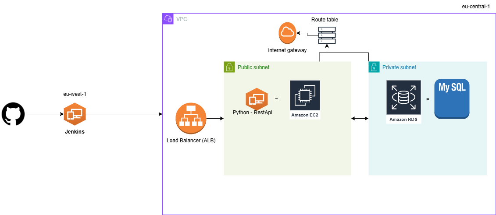

### Devops Deployment Project
- Deploy python flask using terraform and jenkins ci/cd in aws. 
- Jenkins server deployment (infra-jenkins)
- Python api deployment(infra-web)
- Tech:
    - AWS: EC2,Route53,ALB,RDS,VPC,godaddy domain,certificate manager.
    - Other: Jenkins(ci/cd),TerraForm, flask ,bash

